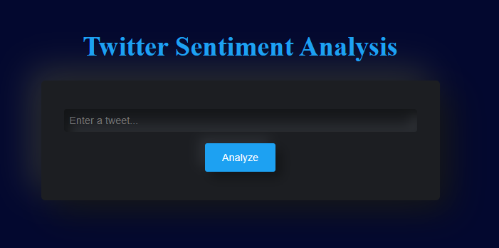

# Week 5: Hands on Project

## Project: Sentiment Analysis for Twitter

### Overview

In this project, I made a sentiment analysis for Twitter. I used the Kaggle dataset from Sentiment140. The dataset contains 1.6 million tweets extracted using the Twitter API. The tweets have been annotated (0 = negative, 4 = positive) and they can be used to detect sentiment.

### Dataset Link

[Sentiment140 Dataset](https://www.kaggle.com/datasets/kazanova/Sentiment140)

## Project Steps

### Backend

1. Load and explore the data
2. Clean the data
3. Split the data into training and testing sets
4. Train a model
5. Evaluate the model
6. Predict on a sample tweet

### Frontend
1. Create a Flask app
2. Create a form for user input
3. Create a route to predict the sentiment of the tweet

## Run the app

1. Clone the repository
2. Install Flask
```
pip install flask
```
3. Run the app
```
python app.py
```
4. Open http://127.0.0.1:5000/ in your browser

## Interface



## Licence

[MIT Licence](./LICENCE)